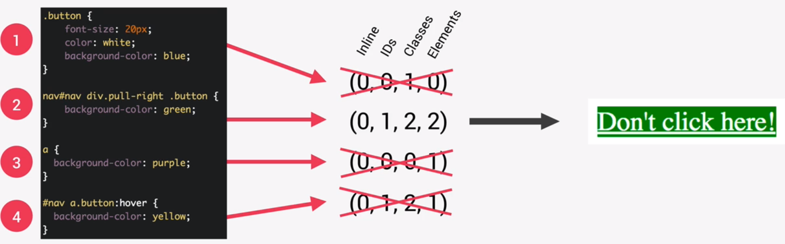
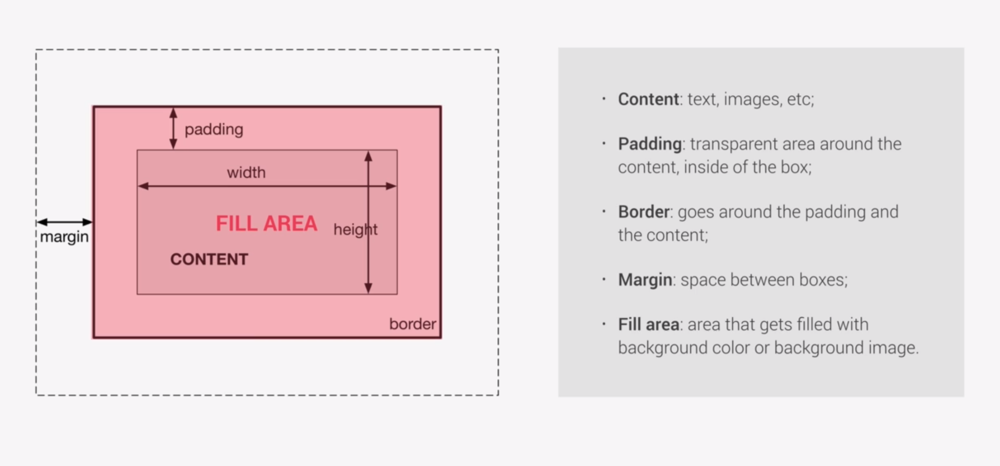

# Section 3 Notes

## Three Pillars Of CSS

Responsive Design

- Build one website which works across all screen sizes on all devices
- Fluid Layouts, Media Queries, Responsive Images, Correct Units, Desktop-first vs Mobile-first.

Maintainable And Scalable Code

- Important for the devs.
- Clean, Easy-to-understand, Growth, Reusable, How to organize files, How to name classes, How to structure HTML

Web Performance

- Makes it faster and smaller in size (so the user has to download less data).
- Less HTTP requests, Less code, Compress code, Use Css preprocessor (like SASS), less images, compress images.

---

## How CSS Works Behind The Scenes

What Happens to CSS When We Load Up a webpage

- Browser loads HTML, parses it and builds the **Document Object Model (DOM)**.
- As the browser parses HTML, it finds the CSS and parses it too.
- During CSS parsing, two main steps occur:
    - Resolves conflicting CSS declarations by cascading.
    - Processes final CSS values (converting percentage to pixels).
    - FROM this it produces the **CSSOM**
- With both the DOM and the CSSOM, we arrive at the **Render Tree**.
- With that we have everything we need to render the page.
- The browser uses the **visual formatting model** to render the page.

Parsing - Cascade and Specificity

- CSS has a selector then a declaration block. A declaration block has a list of declarations which are composed of a CSS Property and a declared value.

> .my-class {
>
> font-size: 20px;
>
> }

- In the first step of parsing, we resolve conflicting CSS statements by cascading.
- Cascade: process of combining different stylesheets and resolving conflicts between different CSS rules and declarations, when more than one rule applies to a certain element.
- CSS can come from different source. The developer (author) is a source, as is the user who could change css values in the browser, as is the browser which might have its default css (i.e. links are blue then when clicked they're purple).

- Cascade combines all the CSS from all the sources and solves conflicts.
- It does this by looking at the **importance** of the **selector specificity** and the **source order** of the conflicting css:
    - Cascade assigns importance following the precedence: User !important declarations; Author !important declarations; Author declarations; User declarations; Default browser declarations.
    - If declarations have the same importance (which is often the case in author declarations), then cascade calculates and compares the specificity of the declaration block selectors in the precedence: Inline styles; IDs; Classes, pseudo-classes, attribute; Elements, pseudo-elements.
    - . selector number 2 has 0 inline points (because it's not an in-line style), has 1 IDs point because it has '#nav', has 2 classes points because it has '.pull-right' and '.button', has 2 elements points because it has 'div' and 'nav'. Selectors ID scores are compared first; 2 and 4 are the highest ranking, the others have lower specificity. Then IDs then Classes, 2 and 4 are still tied. Then elements, 2 wins - so the button is green.
        - Note that pseudoclasses are counted as additional classes, e.g. 'button:hover' is 2 classes.
    - If selectors have the same specificity, then we look at source order - the last written css declaration in the code will be used.

- When seeking maintainability, try to avoid !important. Rely on specificity of selector names rather than their orders. You do need to rely on order when using 3rd party stylesheets, so make sure your stylesheet is called last in the HTML.

Parsing - Value Processing

- first we get the declared values for the property
- then we get the cascaded value (value after resolving conflicts)
- then we get the specified value (the default (initial) value, only used if there is no cascaded value i.e. the author, user or browser has nothing specified, i.e. padding's initial value is 0px. Could also be the inherited value from a parent)
- then we get the computed value (converting relative values to absolute).
- Then we get the used value, final calculations based on layout.
- Then we get the actual value, maybe do some rounding up etc.

### How are units converted from relative to absolute?
- Note 'em' units in fonts are calculate relative to their parents, but lengths are relative to the elements current length. 'rem' elements are calculated relative to the root element (browser's root font-size is usually 16px).

Parsing - Inheritance

- every css property must have a value. If there is no cascaded value the browser will first look for inherited properties, then the specified value.
- Inherited computed values are the computed values of the parent element. I.e. if parent has font-size 20px and line-height 150%, and child has font-size 25px, child will inherited line-height of 30px (150% of 20px - the parent elem).
- inheritance allows for more maintainable code. As a rule of thumb, properties related to text are inherited, others usually aren't.
- inheritance only works if the child has no declared value for that property
- the `inherit` keyword forces inheritance on a certain property.
- the `initial` keyword resets a property to its initial value.

CSS Rendering: Visual Formatting Model

- VFH is an algorithm that calculates boxes and determines the layout of these boxes, for each element in the render tree, in order to determine the final layout of the page.
- The algorithm considers: dimensions of the boxes (the box model), box type (inline, block or inline-block), positioning scheme (floats and positioning), stacking contexts, other elements in the render tree, viewport size, dimensions of images.

### The Box Model

- total width = right border + right padding + specified width (or the one calculated to fit the content) + left padding + left border
- total height = top border + top padding + specified height (or the one calculated to fit the content) + bottom padding + bottom border

- `box-sizing: border-box` changes how this calculation works, padding and border are no longer considered. This way when you set a defined width, your padding is not added on top of it

### Box Types: Inline, Block-level and Inline-Block

- Box model applies to block-level elements
- Inline boxes have no heights or widths or line breaks, they only occupy the space (distributed in lines) that their content needs. Additionally, only horizontal paddings and margins apply
- inline-block use the box model but do only occupy the content's space and has no line-breaks.

### Postioning Schemes: Normal flow, Absolute Positioning, Floats

- Normal flow is what you get if you do nothing to it. Lays elements out on the page in the order they are in the code.
- Float removes elements from the normal flow and shifts it to the left or right until it touches its container edge or another floating element. Text and inline elements will wrap around the floated element. The container will not adjust its height to the element.
- Absolute positioning removes the element from the normal flow. Element has no impact on surrounding content or elements. Element can overlap other elements, which is where stacking contexts come into play.

### Stacking Contexts

- Higher stacked elements appear at the forefront, z-index property is used to create new stacking contexts. There are other properties which affect stacking context too.

CSS Architecture, Components and BEM

- think about the layout, build the layout and at the same type use a logical css architecture.
- Think - component driven design (atomic design). Make modular building blocks held together by the overall layout of the page. These should be re-usable across the project and between different projects.
- Build - Block Element Modifier is a good naming method. `block__element--modifier`. `block` is a standalone component that is meaningful on its own. `element` is part of a block and has no standalone meaing. `modifier` a different version of a block or an element, i.e. we might have a btn block which can have a rounded modifier `btn--rounded` - a lot of people don't like BEM cause it's a bit ugly and a lot to write.
- Architect - 7-1 pattern. Has 7 different folders for partial Sass (or other css pre-processor) files and 1 main Sass file to import all other files into a compiled CSS stylesheet. 7 folders: (base/, components/, layout/, pages/, themes/, abstracts/, vendors/).

